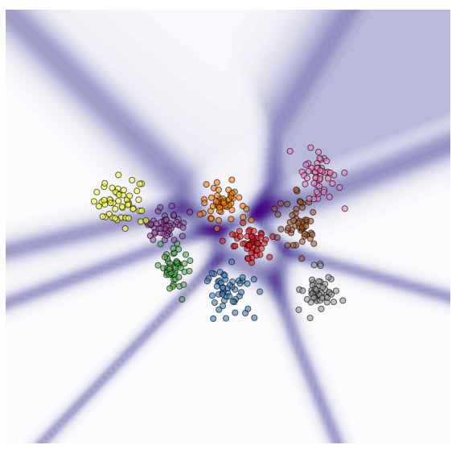
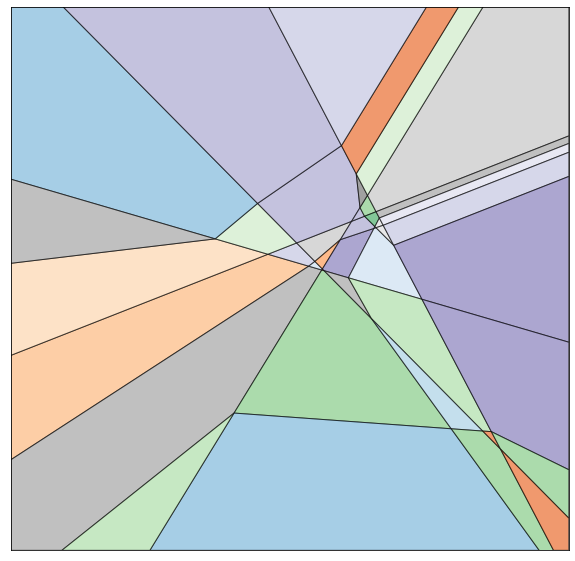
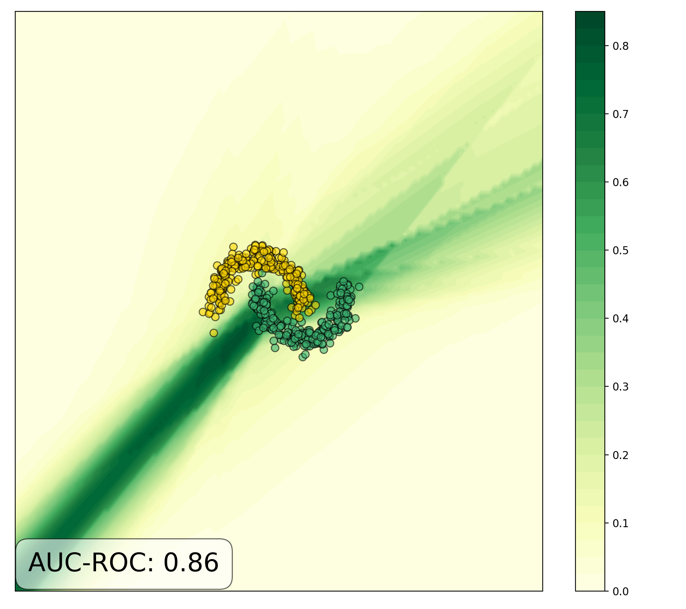
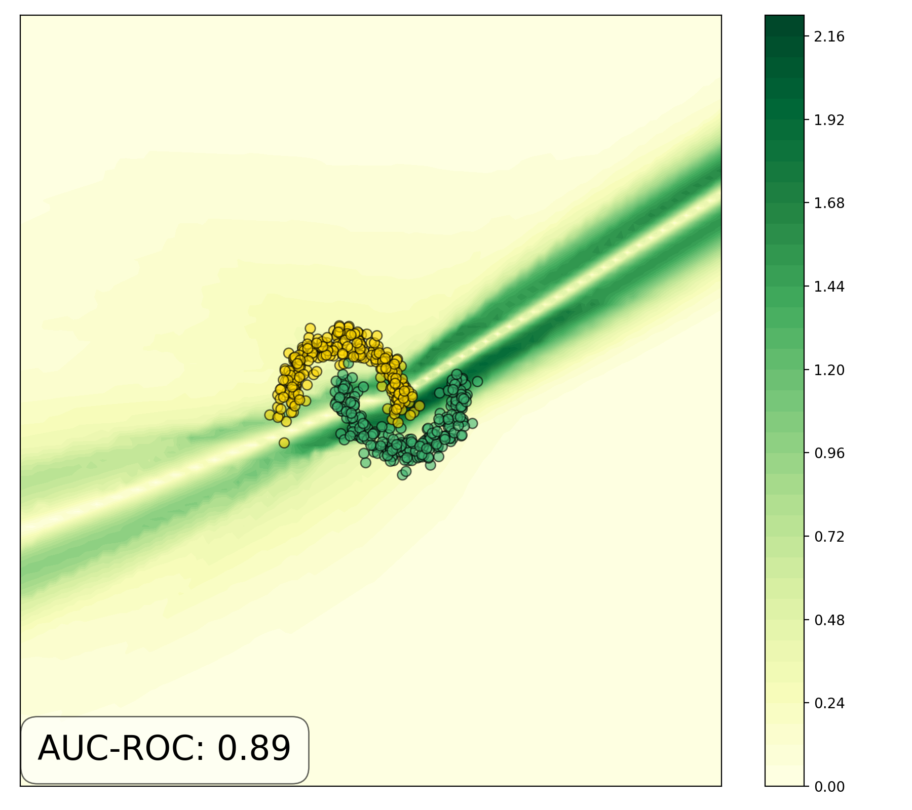
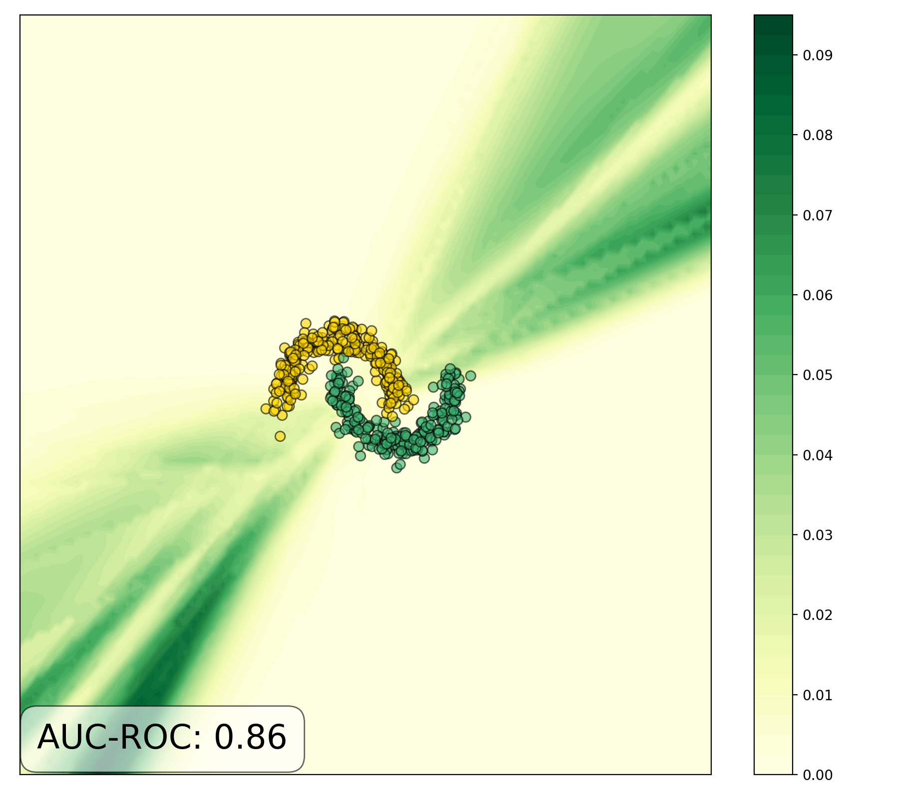

# Know Your Limits: Uncertainty Estimation with ReLU Classifiers Fails at Reliable OOD Detection

This is the Github repository for the UAI 2021 of the same name, investigating 
how ReLU activation functions and the softmax function in neural classifiers 
This repository give an overview over findings, explain the repository structure and gives instruction on installation 
and usage. 

The paper can be found [here](https://arxiv.org/pdf/2012.05329.pdf).
Please use the information below to cite our work:

    @inproceedings{ulmer2021know,
        title={Know your limits: Uncertainty estimation with relu classifiers fails at reliable ood detection},
        author={Ulmer, Dennis and Cin{\`a}, Giovanni},
        booktitle={Uncertainty in Artificial Intelligence},
        pages={1766--1776},
        year={2021},
        organization={PMLR}
    }

## Findings 

We build on previous research by Arora et al. (2018), showing that neural networks with piece-wise linear activation 
functions divide the feature space into polytopal regions, on which they can be expressed as an affine function. The 
plots below show the predictive entropy of a neural classifier on a synthetic multi-class classification problem (left)
as well as the polytopes it induces in the feature space (right; using the code of Jordan et al., 2019).

    
    

We prove formally that on the open-ended polytopes that extend infinitely, the predicted class probabilities for a point, 
but also the uncertainty of the classifier will approach fixed points in the limit. We illustrate this by measuring the 
magnitude of the model output (or uncertainty) w.r.t. to the input x. In regions where these scores don't change, a 
small change in the input won't change the score - thus the gradient will be short or even zero. We show this behavior 
for different models and uncertainty metrics, see some plots below (and more in the paper section 6 and appendix B).

 |  |  |
|:------------------------------:|:-------------------------------------------------:|:-----------------------------------:|
Neural discriminator with max. prob. (Hendrycks & Gimpel, 2017) |  MC Dropout (Gal & Ghahramani, 2016) with mutual information (Smith & Gal, 2018) | Neural ensemble (Lakshminarayanan et al., 2017) with class variance (Smith & Gal, 2018) | 

Why is this problematic? This means that there are large regions of the feature space where uncertainty scores are being
overgeneralized although there is a lack of training data - meaning that distinguishing in-distribution from 
out-of-distribution examples using class probabilities or uncertainty scores becomes impossible. Refer to section 6 and 
7 of the paper for a more in-depth discussion of our results.

## Installation

After cloning this repo, use `pip` to install the necessary dependencies:

    pip3 install -r requirements.txt

There also exists a separate requirements file for the `multiclass_toy_uncertainty_polytopes.ipynb`, which can be 
installed in the same way:

    pip3 install -r requirements_plot.txt

Note that to use the notebook, you have to install the following external [repository](https://github.com/revbucket/geometric-certificates):

    git clone https://github.com/revbucket/geometric-certificates.git

The notebook has to be placed in `examples/` folder for the cloned repo. Note that these steps are also detailed in the 
notebook itself.

## Repository Structure

* `hyperparameters/`: Contains the hyperparameters found for the half-moons dataset using `hyperparameter_search.py`.
* `plots/`: Folder containing all plots generated for the paper and more.
* `src`: Containing modules adapted from [EHR OOD detection](https://github.com/Pacmed/ehr_ood_detection):
    * `anchored_ensemble.py`: Implementation of anchored ensemble (Pearce et al., 2020).
    * `bbb.py`: Implementation of Bayes-by-backprop (not used in the paper; Blundel et al., 2015).
    * `info.py`: Module defining used hyperparameters, hyperparameter search ranges and default training parameters.
    * `mlp.py`: Implementation of a MLP, MLP with Platt Scaling (Guo et al., 2017) and MC Dropout (Gal & Ghahramani, 2016).
    * `model_init.py`: Defining the function that instantiates models.
    * `nn_ensemble.py`: Definition of a neural ensemble (Lakshminarayanan et al., 2017).
    * `novelty_estimator.py`: Common interface to retrieve uncertainty scores and gradient magnitudes for different models.
    * `utils.py`: Simple utility functions.

## Usage

In order to re-run the hyperparameter search, run

    python3 hyperparameter_search.py

This performs the search for all models. Plots from figures 3, 5 and 6 can be reproduced by running 

    python3 create_metric_plots.py

Both scripts supply a `-h` / `--help` option so that scripts can e.g. only be run for certain models.
In order to reproduce figure 1, run the steps in notebook `multiclass_toy_uncertainty_polytopes.ipynb`.

## Bibliography 

Raman Arora, Amitabh Basu, Poorya Mianjy, and Anirbit Mukherjee. Understanding deep neural networks withrectified linear
units. In 6th International Conference on Learning Representations, ICLR 2018, Vancouver, BC,Canada, April 30 - May 3, 
2018, Conference Track Proceedings. OpenReview.net, 2018.

Charles Blundell, Julien Cornebise, Koray Kavukcuoglu, and Daan Wierstra. Weight uncertainty in neural networks. arXiv 
preprint arXiv:1505.05424, 2015.

Gal, Yarin, and Zoubin Ghahramani. "Dropout as a bayesian approximation: Representing model uncertainty in deep 
learning." international conference on machine learning. 2016.

Chuan Guo, Geoff Pleiss, Yu Sun, and Kilian Q. Weinberger. On calibration of modern neural networks. In Proceedings of 
the 34th International Conference on Machine Learning, ICML2017, Sydney, NSW, Australia, 6-11 August 2017, pages 
1321–1330, 2017.

Dan Hendrycks and Kevin Gimpel. A baseline for detecting misclassified and out-of-distribution examples in neural 
networks. In 5th International Conference on Learning Representations, ICLR 2017, Toulon, France, April 24-26, 2017, Conference Track Proceedings, 2017.

Matt Jordan, Justin Lewis, and Alexandros G. Dimakis. Provable certificates for adversarial examples: Fitting a ball in 
the union of polytopes. In Hanna M. Wallach, Hugo Larochelle, Alina Beygelzimer, Florence d’Alché-Buc, Emily B. Fox, and
Roman Garnett, editors, Advances in Neural Information Processing Systems 32: Annual Conference on Neural Information 
Processing Systems 2019, NeurIPS 2019, December 8-14, 2019, Vancouver, BC, Canada, pages 14059–14069, 2019.

Lakshminarayanan, Balaji, Alexander Pritzel, and Charles Blundell. "Simple and scalable predictive uncertainty 
estimation using deep ensembles." Advances in neural information processing systems. 2017.

Pearce, Tim, Felix Leibfried, and Alexandra Brintrup. "Uncertainty in neural networks: Approximately Bayesian 
ensembling." International conference on artificial intelligence and statistics. PMLR, 2020.

Smith, Lewis and Gal, Yarin. Understanding measures of uncertainty for adversarial example detection. In Proceedings of 
the Thirty-Fourth Conference on Uncertainty in Artificial Intelligence, UAI 2018, Monterey, California, USA, August 
6-10, 2018, pages 560–569, 2018.
